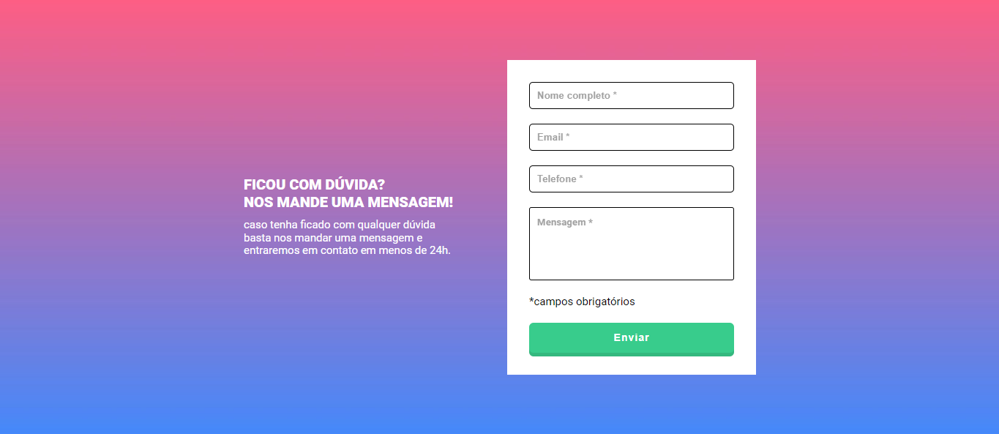

<h1 align="center">DevQuest - formulário</h1>

Quest do curso Dev em dobro, requerimento de um formulário utilizando HTML, CSS e JS.

## Índice

- [Visão Geral](#visão-geral)
- [Funcionalidades](#funcionalidades)
- [Demo](#demo)
- [Contato](#contato)  
Imagem do projeto

Imagem original

## Visão Geral

Desafio feito com HTML, CSS E JS. A validação do formulário foi feito utilizando condições e laços, este projeto me fez aprender coisas que não sabia, como o trim() e o event.preventDefault()

## Funcionalidades

- Valida as informações dos inputs do formulário, caso não digite nada e envie, dará erro.
- HTML
- CSS
- JS

## Demo

[Link para a demonstração do projeto)](https://bruno-nog.github.io/quest-formulario-intermediario/)

## Contato

